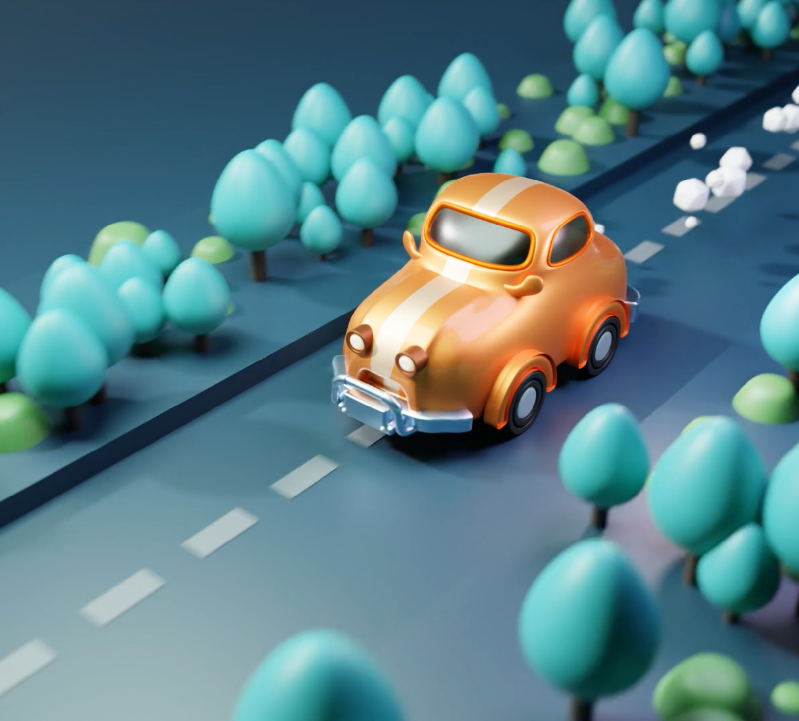

# Blender-3D-Modeling-and-Animation

I'm learning modeling, animation and materials these days! Here, I've documented my journey learning various Blender skills, from hard surface modeling to advanced lighting.

## Contents

1. [Coin Station](#Coin Station)
2. [Flying Car](#Flying Car)
3. [Stump](#animation)

---

### Coin Station

In this section, I delve into the intricacies of hard surface modeling.

- **Files:** [Coin_Station.blend](./Blender_Projects/Coin_Station.blend)

---

### Flying Car

Animation brings life to models. In this section, I use animation and particals to add 

- **Files:** [Flying_Car.blend](./Blender_Projects/Flying_Car.blend)

---

### Stump

Sculpting is an art of shaping a model like a sculptor. This section showcases the organic models I've created using Blender's sculpting tools.

- **Files:** [Stump.blend](./Blender_Projects/Stump.blend)

